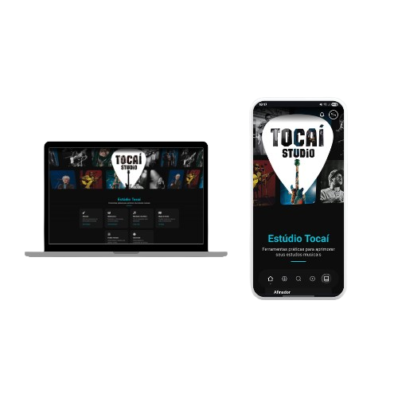

# 🎵 TocaíStudio

**TocaíStudio** é uma plataforma online interativa para músicos de todos os níveis. Oferecemos ferramentas essenciais como afinador, metrônomo, montador de cifras e muito mais — tudo gratuito, direto no navegador.

🔗 **Acesse agora:** [https://tocaistudio.vercel.app](https://tocaistudio.vercel.app)

---

## ✨ Funcionalidades

- 🎸 **Afinador Online** – Detecta e exibe a nota tocada em tempo real.
- 🥁 **Metrônomo Interativo** – Pratique ritmo com precisão ajustando o BPM.
- 🎼 **Montador de Cifras** – Crie e edite cifras personalizadas com facilidade.
- 🗺️ **Mapa de Notas** – Visualize todas as notas no braço do violão ou guitarra.
- 🤖 **HarmonIA** – Assistente com inteligência artificial para auxiliar na composição musical.
- 🎤 **Artistas e Músicas** – Sistema de busca com páginas dedicadas para artistas e bandas.
- 📱 **Responsivo** – Layout adaptado para dispositivos desktop e móveis.

---

## 🛠️ Tecnologias Utilizadas

- HTML5, CSS3 e JavaScript puro
- Deploy e hospedagem via Vercel
- SEO otimizado com meta tags, Open Graph e dados estruturados (Schema.org)
- Ícones usando Font Awesome, Boxicons e Remixicon
- Arquivos de configuração: `vercel.json`, `sitemap.xml`, e `robots.txt`

---

## 📄 Licença

Distribuído sob a Licença MIT. Veja o arquivo `LICENSE` para mais detalhes.

Este projeto utiliza componentes de código aberto, incluindo os pedais virtuais do repositório [guitarstack](https://github.com/lucaong/guitarstack).

---

## 🤝 Contribuindo

Atualmente o projeto é mantido por uma única pessoa. Sugestões são muito bem-vindas! Futuramente, contribuições poderão ser aceitas via Pull Requests.

---

> 🎶 TocaíStudio — A música na ponta dos dedos.
